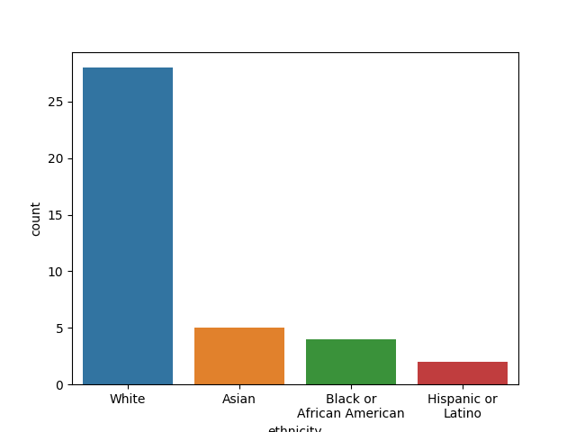
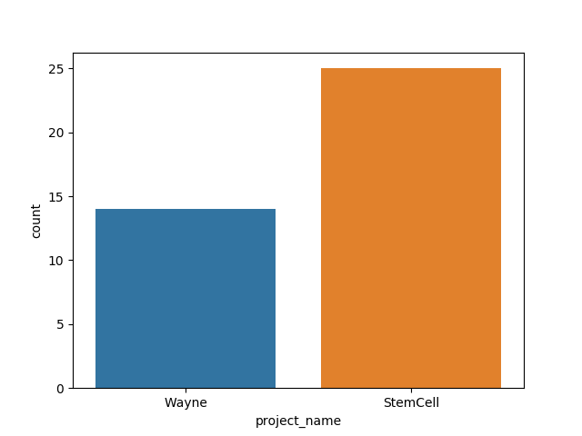
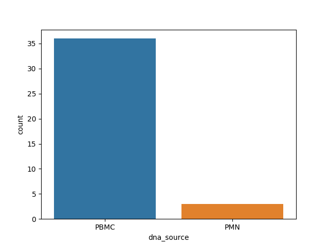
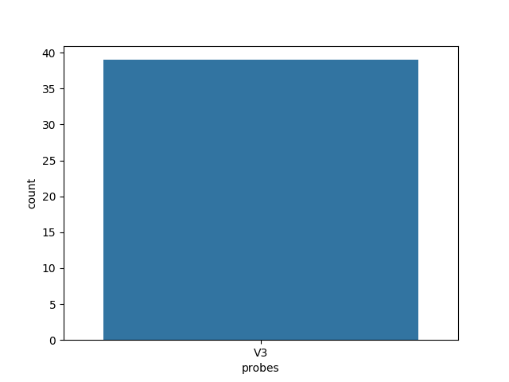

   
<h1>IGH-Genomics</h1>
<table>
<thead>
<tr><th style="text-align: right;">  Number of
samples</th><th style="text-align: right;">  Sequencing
datasets</th></tr>
</thead>
<tbody>
<tr><td style="text-align: right;">                 39</td><td style="text-align: right;">                   39</td></tr>
</tbody>
</table>

<h3>Ethnicity</h3>

 
<h3>Projects</h3>

 
<h3>DNA source</h3>

 
<h3>Probes</h3>

 
